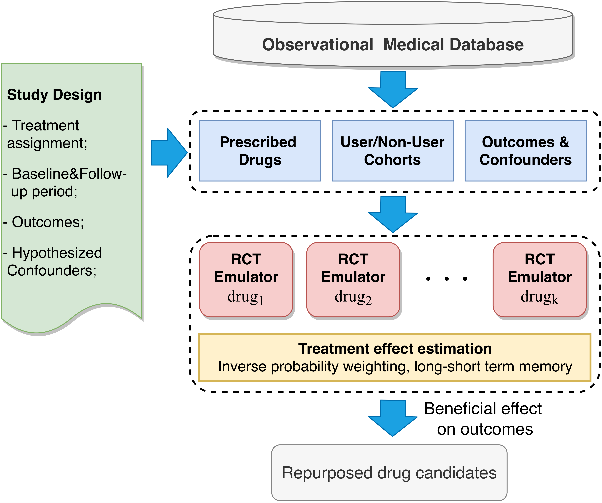
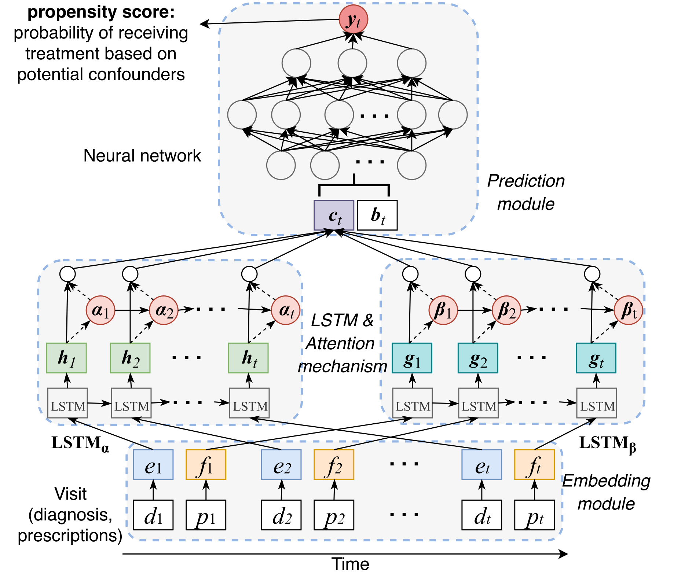

# DeepIPW

## 1. Introduction
This repository contains source code and data description for paper "[A deep learning framework for drug repurposing via emulating clinical trials on real world patient data](https://arxiv.org/abs/2007.10152)". 
(accepted by **_Nature Machine Intelligence_**).

In this paper, we present an efficient and easily-customized framework for generating and testing multiple candidates for drug repurposing using a retrospective analysis of real world data (RWD). 


Building upon well-established causal inference and deep learning methods, our framework emulates randomized clinical trials for drugs present in a large-scale medical claims database.


We demonstrate our framework on a coronary artery disease (CAD) cohort of millions of patients. We successfully identify drugs and drug combinations that significantly improve the CAD outcomes but not have been indicated for treating CAD, paving the way for drug repurposing.

## 2. System requirement
OS: Ubuntu 16.04

GPU: NVIDIA 1080ti (11GB memory) is **minimum** requirement. We recommend NVIDIA TITAN RTX 6000 GPUs. 

## 3. Dependencies
```
Python 3.6
Pytorch 1.2.0
Scipy 1.3.1
Numpy 1.17.2
Scikit-learn 0.22.2
```

## 4. Preprocessing data
### Dataset
The real world patient data used in this paper is [MarketScan claims data](https://www.ibm.com/products/marketscan-research-databases). Interested parties may contact IBM for acquiring the data access at this 
[link](https://www.ibm.com/products/marketscan-research-databases).

##### Data flow chart


Source: 2012 MarketScan&reg; CCAE MDCR User Guide

##### Data files used 
- Inpatient Admissions (I) : Admission summary records
- Outpatient Services (O): Individual outpatient claim records
- Outpatient Pharmaceutical Claims (D): Individual outpatient prescription drug claim records
- Population (P): Summarizes demographic information about the eligible population

### Input data demo
The demo of the input data can be found in the [data](data/) folder, where the data structures and a [synthetic demo](data/synthetic) of the inputs are provided. Before running the preprocessing codes, make sure the input data format is same to the provided input demo.

##### [Cohort](data/synthetic/Cohort.csv)
The data structure for [cohort table](data/synthetic/Cohort.csv) is as follows,

| Column Name | Description                        | Note                                                                                                                                 |
|-------------|------------------------------------|--------------------------------------------------------------------------------------------------------------------------------------|
| ENROLID     | Patient enroll ID                  | Unique identifier for each patient                                                                                                   |
| Index_date  | The date of first CAD encounter    | i.e., min (ADMDATE [1st CAD admission date for the inpatient records],SVCDATE [1st CAD service date for the outpatient records]) |
| DTSTART     | Date of insurance enrollment start | M/D/Y, e.g., 03/25/2732                                                                                                              |
| DTEND       | Date of insurance enrollment end   | M/D/Y, e.g., 03/25/2732                                                                                                              |

##### [Drug table](data/synthetic/drug)
The data structure for the [drug table](data/synthetic/drug/drug12.csv) is as follows,

| Column Name | Description                                                                  | Note                                                                                                                    |
|-------------|------------------------------------------------------------------------------|-------------------------------------------------------------------------------------------------------------------------|
| ENROLID     | Patient enroll ID                                                            | Unique identifier for each patient                                                                                      |
| NDCNUM      | National drug code ([NDC](https://www.fda.gov/drugs/drug-approvals-and-databases/national-drug-code-directory))                                                     | We map NDC to observational medical<br>outcomes partnership ([OMOP](https://ohdsi.org/)) ingredient concept ID, and obtain 1,353 unique drugs |
| SVCDATE     | Date to take the prescription                                                | M/D/Y, e.g., 03/25/2732                                                                                                 |
| DAYSUPP     | Days supply. The number of days of drug therapy covered by this prescription | Day, e.g., 28                                                                                                           |

##### [Inpatient table](data/synthetic/inpatient)
The data structure for the [inpatient table](data/synthetic/inpatient/inpat12.csv) is as follows,

| Column Name  | Description                                       | Note                                                                                                                                                            |
|--------------|---------------------------------------------------|-----------------------------------------------------------------------------------------------------------------------------------------------------------------|
| ENROLID      | Patient enroll ID                                 | Unique identifier for each patient                                                                                                                              |
| DX1-DX15     | Diagnosis codes. International Classification of Diseases ([ICD](https://www.cdc.gov/nchs/icd/index.htm)) codes                                | 57,089 ICD-9/10 codes considered in the dataset. Dictionary for [ICD-9](http://www.icd9data.com/2015/Volume1/default.htm) and [ICD-10](https://www.icd10data.com/) codes.|
| DXVER        | Flag to denote ICD-9/10 codes                     | “9” = ICD-9-CM and “0” = ICD-10-CM                                                                                                                              |                                                                                                                                                            |
| ADMDATE      | Admission date for this inpatient visit           | M/D/Y, e.g., 03/25/2732                                                                                                                                         |
| Days         | The number of days stay in the inpatient hospital | Day, e.g., 28                                                                                                                                                   |

##### [Outpatient table](data/synthetic/outpatient)
The data structure for the [outpatient table](data/synthetic/outpatient/outpat12.csv) is as follows,

| Column Name  | Description                                       | Note                                                                                                                                                            |
|--------------|---------------------------------------------------|-----------------------------------------------------------------------------------------------------------------------------------------------------------------|
| ENROLID      | Patient enroll ID                                 | Unique identifier for each patient                                                                                                                              |
| DX1-DX4     | Diagnosis codes. International Classification of Diseases ([ICD](https://www.cdc.gov/nchs/icd/index.htm)) codes                                | 57,089 ICD-9/10 codes considered in the dataset. Dictionary for [ICD-9](http://www.icd9data.com/2015/Volume1/default.htm) and [ICD-10](https://www.icd10data.com/) codes.|
| DXVER        | Flag to denote ICD-9/10 codes                     | “9” = ICD-9-CM and “0” = ICD-10-CM                                                                                                                              |                                                                                                                                                             |
| SVCDATE      | Service date for this outpatient visit           | M/D/Y, e.g., 03/25/2732                                                                                                                                         |                                                                                                                                                |

##### [Demographics](data/synthetic/demo.csv)
The data structure for [demo table](data/synthetic/demo.csv) is as follows,

| Column Name | Description        | Note                               |
|-------------|--------------------|------------------------------------|
| ENROLID     | Patient enroll ID  | Unique identifier for each patient |
| DOBYR       | birth year         | Year, e.g., 2099                   |
| SEX         | gender             | 1- male; 2- female                 |

### Preprocess drug tables
```
cd preprocess
python pre_drug.py --input_data_dir ../data/synthetic/drug --output_data_dir 'pickles/cad_prescription_taken_by_patient.pkl'
```

### Preprocess patient cohort
```
# Note: Here's just a demo case for parameter selection. They can be easily adjusted for different application scenario. 
cd preprocess
python run_preprocess.py --min_patients 10 --min_prescription 2 --followup 60 --time_interval 240 --baseline 10 --input_data ../data/synthetic --save_cohort_all save_cohort_all/
```

### Parameters
- --min_patients, minimum number of patients for each cohort.
- --min_prescription, minimum times of prescriptions of each drug.
- --time_interval, minimum time interval for every two prescriptions.
- --followup, number of days of followup period.
- --baseline, number of days of baseline period.
- --input_pickles, data pickles.
- --save_cohort_all, save path.


## 5. DeepIPW model
### Bash command
```
bash run_lstm.sh
```
### Python command
```
cd deep-ipw
python main.py
```

### Parameters
- --data_dir, input cohort data
- --pickles_dir, pickles file.
- --treated_drug_file, current evaluating drug.
- --controlled_drug, sampled controlled drugs (randomly sampling or ATC class).
- --controlled_drug_ratio, ratio of the number of controlled drug.
- --input_pickles, data pickles.

